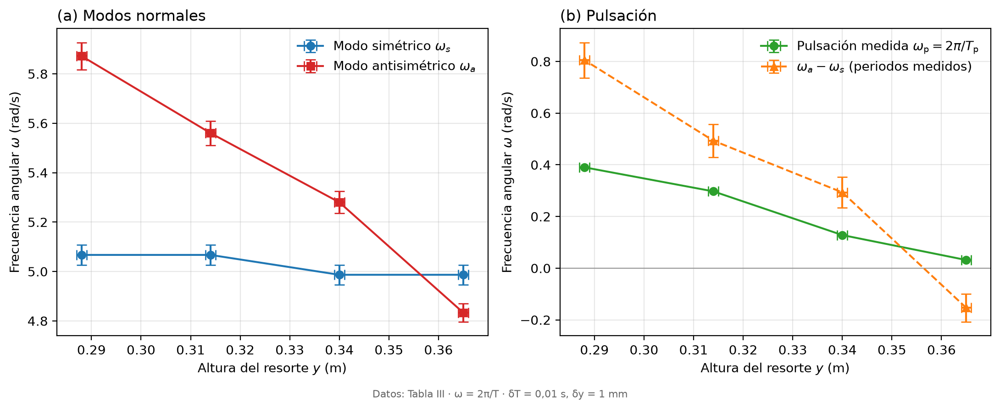
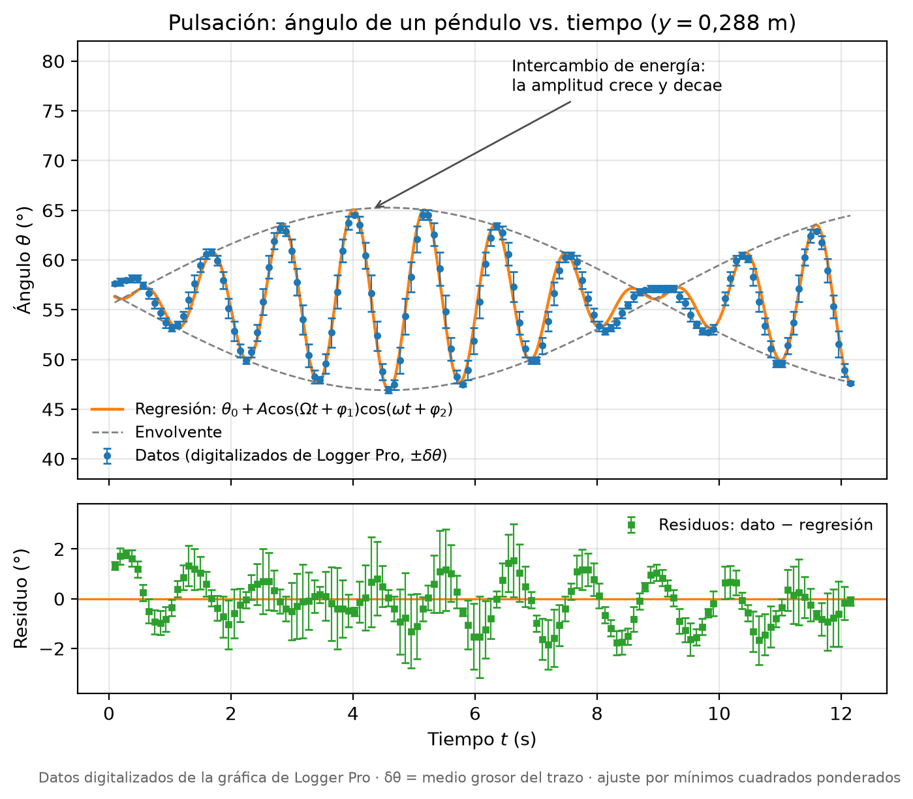

# Péndulos acoplados

Análisis de datos de la práctica de péndulos físicos acoplados por un resorte.

## Constante del resorte

`constante_resorte.py` ajusta la masa colgada en función del alargamiento del resorte
(Tabla II), con barras de error y residuos. En equilibrio `k x = m g`, así que la
pendiente `b` del ajuste `m = b x + c` da `k = b g`.

```bash
pip install numpy matplotlib
python constante_resorte.py
```

Genera `constante_resorte.png` y `constante_resorte.pdf`.

Resultados:

| Parámetro | Valor |
|---|---|
| b | (2419 ± 59) g/m |
| c | (−0,2 ± 1,9) g |
| R | 0,9991 |
| k = b g | (23,7 ± 0,6) N/m |

Incertidumbres instrumentales: δx = 1 mm (regla), δm = 0,01 g (balanza); g = 9,8 m/s².


## Modos normales

`modos_normales.py` usa los periodos de la Tabla III. Para dos péndulos físicos
acoplados por un resorte a distancia `d` del eje,
`ω_a² = ω_s² + 2 k d² / I`, así que `ω_a² − ω_s²` contra `d²` es una recta.
El script hace el ajuste lineal con barras de error y residuos.

```bash
python modos_normales.py
```

| Parámetro | Valor |
|---|---|
| b (ajuste) | (970 ± 192) s⁻²·m⁻² |
| c | (−0,8 ± 1,2) s⁻² |
| R | 0,9629 |

Incertidumbres: δT = 0,01 s, δd = 1 mm.


## Frecuencias vs. altura del resorte

`frecuencias.py` grafica las frecuencias angulares `ω = 2π/T` de la Tabla III contra
la altura `y` del resorte: (a) los modos normales `ω_s` y `ω_a`; (b) la pulsación
medida `ω_p` superpuesta con `ω_a − ω_s` calculada con los periodos medidos.

```bash
python frecuencias.py
```



## Pulsación: ángulo vs. tiempo

`pulsacion.py` digitaliza la curva de la captura de Logger Pro
(`logger_pro_pulsacion.png`, resorte en y = 0,288 m) y ajusta el modelo de pulsación
`θ(t) = θ0 + A cos(Ωt + φ1) cos(ωt + φ2)`. La incertidumbre de cada punto es la mitad
del grosor del trazo en la imagen.

```bash
python pulsacion.py
```

| Parámetro | Valor |
|---|---|
| ω (portadora) | (5,393 ± 0,006) rad/s |
| Ω (envolvente) | (0,3594 ± 0,0016) rad/s |
| ω_s = ω − Ω | (5,034 ± 0,006) rad/s |
| ω_a = ω + Ω | (5,753 ± 0,006) rad/s |
| Periodo de la envolvente π/Ω | (8,74 ± 0,04) s |


