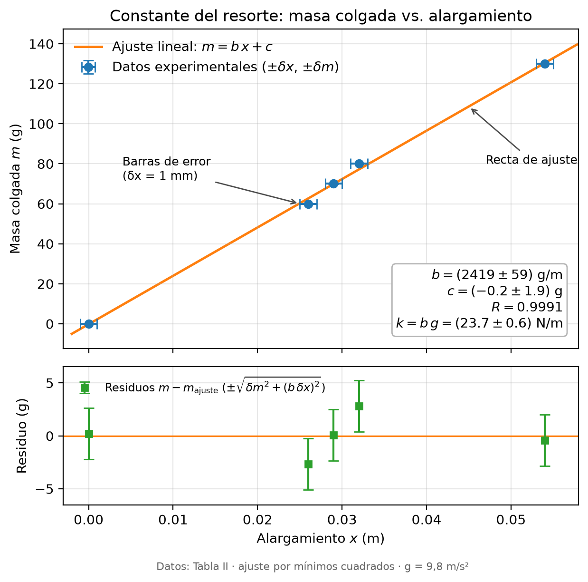
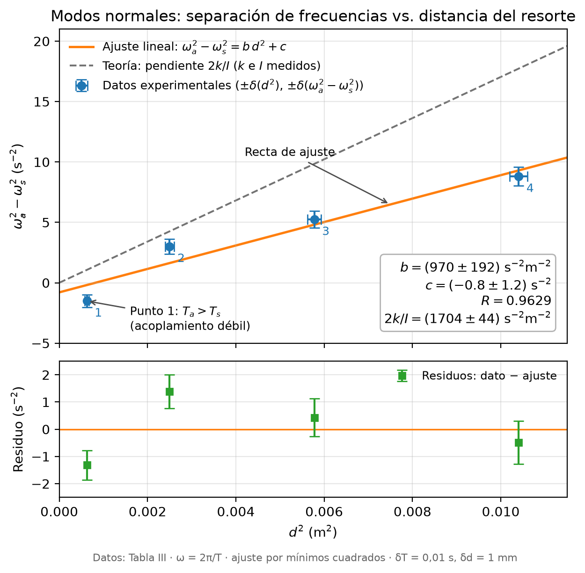

# Péndulos acoplados

Análisis de datos de la práctica de péndulos físicos acoplados por un resorte.

## Constante del resorte

`constante_resorte.py` ajusta la masa colgada en función del alargamiento del resorte
(Tabla II), con barras de error y residuos. En equilibrio `k x = m g`, así que la
pendiente `b` del ajuste `m = b x + c` da `k = b g`.

```bash
pip install numpy matplotlib
python constante_resorte.py
```

Genera `constante_resorte.png` y `constante_resorte.pdf`.

Resultados:

| Parámetro | Valor |
|---|---|
| b | (2419 ± 59) g/m |
| c | (−0,2 ± 1,9) g |
| R | 0,9991 |
| k = b g | (23,7 ± 0,6) N/m |

Incertidumbres instrumentales: δx = 1 mm (regla), δm = 0,01 g (balanza); g = 9,8 m/s².



## Modos normales

`modos_normales.py` usa los periodos de la Tabla III. Para dos péndulos físicos
acoplados por un resorte a distancia `d` del eje,
`ω_a² = ω_s² + 2 k d² / I`, así que `ω_a² − ω_s²` contra `d²` es una recta de
pendiente `2k/I`. El script ajusta esa recta y la compara con la pendiente teórica
que dan `k = (23,7 ± 0,6) N/m` e `I = (2,782 ± 0,014)×10⁻² kg·m²`.

```bash
python modos_normales.py
```

| Parámetro | Valor |
|---|---|
| b (ajuste) | (970 ± 192) s⁻²·m⁻² |
| c | (−0,8 ± 1,2) s⁻² |
| R | 0,9629 |
| 2k/I (teórico) | (1704 ± 44) s⁻²·m⁻² |

Incertidumbres: δT = 0,01 s, δd = 1 mm.


